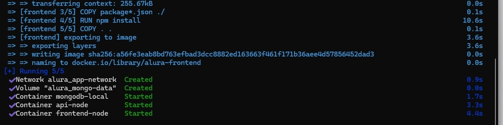
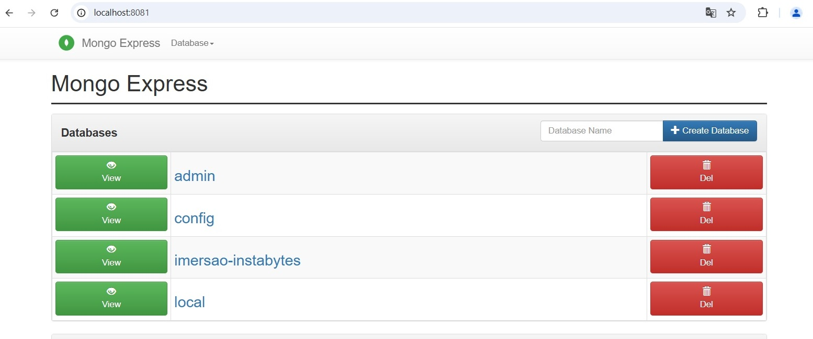

# Imersão back-end - Alura


Nesta imersão feita em novembro de 2024 e promovida pela Alura em parceria com o Google foi feita a criação de uma API utilizando o banco de dados Mongo. A API guardava imagens, que seriam consumidas por um frontend fornecido pela Alura. Foi feita a integração com o Google Gemini para gerar a descrição das imagens.

## Recursos utilizados

- NodeJS
- Mongo
- Google Gemini

Neste repositório estão disponíveis os materiais de estudos do curso e os codigos fontes da aplicação.

## Instalação

Para executar a aplicação foi utilizado o **Docker** para organizar o banco de dados, o frontend e o backend. Para isso foi criado um arquivo docker-compose.yml. Foi feita também a persistência de dados do mongo na pasta mongo-data localizada na raiz. Para facilitar a consulta ao banco de dados, foi instalado um serviço chamado mongo-express.

Os testes foram feitos no Windows. Primeiro foi iniciado o Docker Desktop. Depois de iniciado, a partir do terminal, dentro da pasta onde se encontra a aplicação, foi executado o seguinte comando:

```docker-compose up -d```



Para encerrar a aplicação

```docker-compose down```

Caso seja necessário corrigir alguma informação no arquivo dockerfile, depois de encerrar a aplicação será necessário subir desta forma:

```docker-compose up --build -d```

O comando --build força a reconstrução da imagem a partir do Dockerfile corrigido, e o -d executa o processo em segundo plano (detached mode).

Caso seja necessário puxar o log de algum serviço que foi definido no arquivo docker-compose.yml, pode ser utilizado o seguinte comando:


```docker-compose logs api```

Sendo que "api" é o nome do serviço dentro do arquivo docker-compose.yml

São usadas as seguintes variáveis de ambiente, que foram definidas no arquivo docker-compose.yml:

**API_URL** - Variável utilizada pelo frontend para conectar com a API
**STRING_CONEXAO** - Variável utilizada pelo backend para conectar com o banco de dados Mongo
**GEMINI_API_KEY** - Variável utilizada pelo backend para conectar com a API do Google Gemini

As portas utilizadas por estes serviços são as seguintes:

| Serviço       | Porta |
| ------------- | ----- |
| Banco Mongo   | 27017 |
| Backend       | 3000  |
| Frontend      | 8000  |
| Mongo Express | 8081  |



## Estrutura Backend

O código do backend se encontra na pasta backend/src e esta organizado da seguinte forma:

**config** - Faz a conexão com o banco de dados Mongo.
**controllers** - Retorna dados para a rota, consumindo dados do Model
**models** - Consome o banco de dados Mongo para persistir ou consultas informações.
**routes** - Possui as rotas da API
**services** - Faz a conexão com a API do Google Gemini

## Utilização

Para utilizar o frontend, basta acessar o endereço:

```http://localhost:8000```

Para inserir os dados sem utilizar o frontend é necessário enviar informações para a API a partir deste endereço:

```http://localhost:3000```

## Rotas da API

| Rota        | Tipo | Descrição                     |
| ----------- | ---- | ----------------------------- |
| /posts      | GET  | Listar posts                  |
| /posts      | POST | Criar novo post               | 
| /upload     | POST | Enviar imagem                 |
| /upload/:id | PUT  | Atualizar imagem do novo post |


## Estrutura de um post

```{
"descricao": "Gato Panqueca",
"imgUrl":"https://placecats.com/millie/300/500",
"alt":"Descrição da imagem"
}```

Para enviar uma uma imagem deve-se enviar um form-data com um campo chamado imagem. A imagem deve estar no formato PNG

Ao criar um post com imagem própria, primeiro enviar a imagem, vai ser gerado um post e será retornado o seu ID. Para inserir a descrição desta imagem basta mandar o ID para a rota /upload<id> utilizando o método PUT. A descrição será gerada usando IA.
